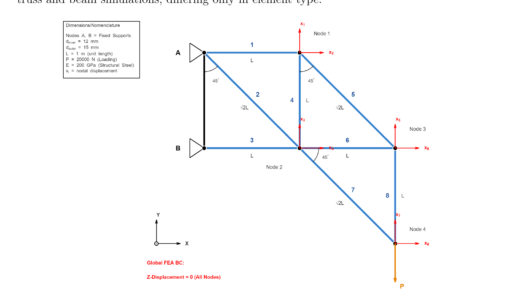
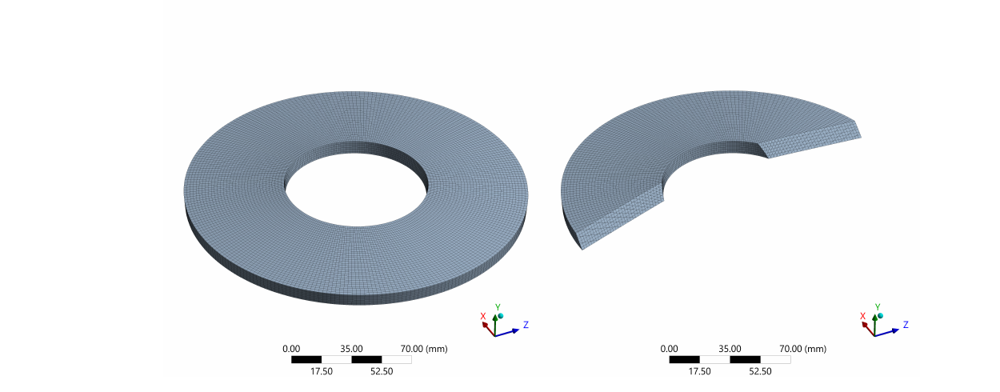

# Solid Mechanics Simulation: Truss FEA Verification & Belleville Spring Non-Linear Analysis

University coursework (Numerical Modelling and Engineering Simulations module, University of Sussex) covering two solid mechanics problems, each solved analytically and then verified against ANSYS Mechanical FEA: a statically loaded planar truss, and a non-linear Belleville disc spring.

## TL;DR

| | Method 1 | Method 2 | Method 3 | Result |
|---|---|---|---|---|
| **Truss displacement** (Node 4, max) | MATLAB (`Ax=b`, LU decomp.) | FEA, link elements | FEA, beam elements | All three agree to within **0.114%** |
| **Truss member stress** | — | FEA beam tool | — | Peak **661.95 MPa** compressive vs. **250 MPa** steel yield — truss as designed is overstressed, would need redesign |
| **Belleville spring constant** *k* at δ=3.72mm | Analytical (Norton eqn. + finite difference) | FEA, 2D axisymmetric | FEA, 3D | Analytical **12,956 N/mm**, FEA 2D **11,828 N/mm** (8.7% off), FEA 3D **20,559 N/mm** (58.7% off — traced to a boundary condition error, not a meshing issue) |
| **Spring force vs. manufacturer** | Analytical: 68,791 N | FEA 2D: 66,533 N | FEA 3D: 78,522 N | Manufacturer quotes 68,204 N — analytical within **0.9%**, FEA 2D within **2.5%**, FEA 3D **15.1%** high |

Full numbers: [`calculations/force-table.md`](calculations/force-table.md). Full report: [`report/full-report.pdf`](report/full-report.pdf).

## What We Did

### Problem 1: Equilibrium Truss

An 8-member planar truss (circular steel tubes, two fixed supports, 20 kN point load) needed solving three independent ways and cross-checking.

**Analytical (MATLAB):** Derived nodal equilibrium (ΣFx=0, ΣFy=0) by hand at all four free nodes, assembled into an 8×8 linear system `Ax = b`, and solved with MATLAB's backslash operator (`A\b`, LU decomposition — the stable, standard choice for a small dense system like this one, instead of explicit matrix inversion). The matrix was deliberately built from symbolic area/angle coefficients rather than hard-coded numbers, so the same script reruns for a different tube size or geometry without re-deriving anything.

> Full derivation, every node's free body diagram, and the assembled matrix: [`calculations/truss-equilibrium-method.md`](calculations/truss-equilibrium-method.md)

**FEA verification, twice over:** Built the same truss in ANSYS Mechanical twice — once with link (axial-only) elements matching the pin-jointed assumption in the hand calc exactly, and once with beam elements that also transmit moment, closer to how a real welded/bolted joint behaves. Reaction force probes at both supports confirmed global equilibrium (ΣFy = 20,000 N = applied load, as required).



### Problem 2: Belleville Spring Washer

A Belleville spring's force-deflection relationship is non-linear, so its spring constant isn't a single fixed number — it has to be evaluated at a specific deflection.

**Analytical:** Implemented Norton's closed-form force-deflection equation for conical disc springs in MATLAB, then numerically differentiated it (second-order central finite difference) at δ = 3.72 mm to get `k`.

> Full equations and worked numbers: [`calculations/belleville-spring-method.md`](calculations/belleville-spring-method.md)

**FEA, 2D then 3D:** Built the 2D axisymmetric model first (cheaper, and the spring genuinely has no circumferential variation, so nothing is lost by reducing to 2D), ran a grid convergence study, then repeated the whole process in 3D. Both required enabling large-deflection (geometric non-linearity) in ANSYS, since the spring undergoes a deflection comparable to its own thickness.



## What Actually Happened

The 2D model came out close to both the manufacturer's data and the analytical prediction (force within 2.5% of manufacturer, spring constant within 8.7% of analytical). The 3D model didn't — it over-predicted force by 15.1% and spring constant by a much larger 58.7%, even though its mesh was independently shown to be converged.

The cause wasn't the mesh. It was a boundary condition: the 3D model needs an extra constraint that the 2D model doesn't, because a 3D solid with only an axial load and an axial support is free to spin about its own axis (a rigid-body mode with no unique solution). The fix used here was a Cartesian constraint (`X = 0, Z = 0`) on the outer top edge. That stops the spinning, but it also resists the *radial* expansion of the outer rim as the cone flattens under load — something the 2D axisymmetric model correctly leaves free. That extra, unintended stiffness grows as the spring deflects further, which is also why the 3D error is worse for the *derivative* (`k`, 58.7% off) than for the *force itself* (15.1% off): finite-differencing amplifies a force error that's growing with deflection into a much larger error in the slope.

The fix, identified but not re-run here for lack of time, is to apply that anti-rotation constraint in a cylindrical coordinate system and restrict only the tangential degree of freedom, leaving the radial direction free. That's flagged explicitly in [`docs/concept-design.md`](docs/concept-design.md) rather than glossed over.

Separately, the peak Von Mises stress predicted by *both* FEA models (2631 MPa in 2D, 2420 MPa in 3D) is well above the 1000 MPa the manufacturer quotes — but it occurs at a sharp re-entrant corner at the inner bore and keeps climbing with mesh refinement instead of converging, which is the standard signature of a numerical stress singularity rather than a real material response. The bulk stress away from that corner stays under 1000 MPa in both models. That distinction (singularity vs. real result) is exactly the kind of thing that's easy to either over-claim or quietly bury, so it's called out directly rather than left in a stress legend for the reader to notice or not.

There's also a small inconsistency in how this was originally reported: the discussion text and one results table both describe the 2D model's force as "2.4% from analytical," but that 2.4% figure is actually the deviation from the *manufacturer's* data, not from the analytical solution (which is closer to 3.3%). It doesn't change the conclusion, but it's the kind of thing worth flagging rather than smoothing over — full breakdown in [`calculations/belleville-spring-method.md`](calculations/belleville-spring-method.md#a-note-on-a-reporting-inconsistency-in-the-original-report).

## Repo Structure

```
.
├── README.md                              <- you are here
├── LICENSE
├── docs/
│   ├── project-brief.md                   <- clean summary of the original assignment
│   └── concept-design.md                  <- method choices, alternatives rejected, and why
├── calculations/
│   ├── truss-equilibrium-method.md        <- full hand derivation, Problem 1
│   ├── belleville-spring-method.md        <- full analytical derivation, Problem 2
│   ├── force-table.md                     <- final tabulated results, both problems
│   ├── Problem1_Truss.m                   <- MATLAB: Ax=b truss solver
│   └── Problem2_BellevilleSpring.m        <- MATLAB: spring constant via finite difference
├── images/                                 <- figures extracted from the report (FEA contours,
│                                              BCs, meshes, hand-calc scans, CAD references)
└── report/
    └── full-report.pdf                    <- original submitted report, unedited
```

## Why This Matters

Both problems are small versions of a question that comes up constantly in real mechanical design: *how do you know your FEA model is telling the truth?* The honest answer is that you don't, automatically — you check it against something independent (hand calculation, a simpler model, test data, or all three) and you investigate disagreements rather than assuming the fancier model is the correct one. The Belleville spring result here is a direct example: the 3D model is geometrically more "complete" than the 2D one, and it was still the wrong one to trust, because the extra dimension introduced a boundary condition that wasn't actually applicable. Building the habit of explaining a discrepancy down to its root cause, rather than reporting a percentage error and moving on, is the actual point of an exercise like this.

## Skills Demonstrated

- Hand-derivation of structural equilibrium equations and assembly into a linear system (`Ax = b`)
- MATLAB: parametric/coefficient-based matrix construction, anonymous functions, numerical linear algebra (LU decomposition via backslash), finite-difference differentiation
- ANSYS Workbench Mechanical: 2D planar (link & beam element), 2D axisymmetric, and 3D static structural analysis
- Mesh convergence studies and justified mesh selection
- Geometric non-linearity (large deflection) for a spring undergoing finite deflection relative to its thickness
- Boundary condition design, including diagnosing an incorrect constraint from its physical symptoms rather than just its numerical output
- Critical comparison of analytical, numerical, and manufacturer reference data, including identifying and correcting a mislabelled result rather than restating it
- Recognising and correctly dismissing a mesh-dependent stress singularity instead of over-interpreting a peak FEA value
- Technical report writing to a fixed page/word budget with full reproducibility (code, derivations, and source files all included)
