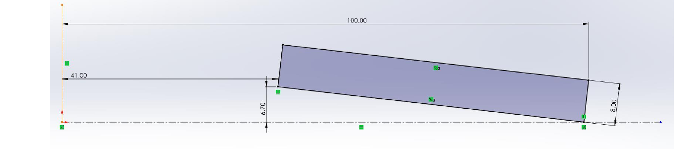
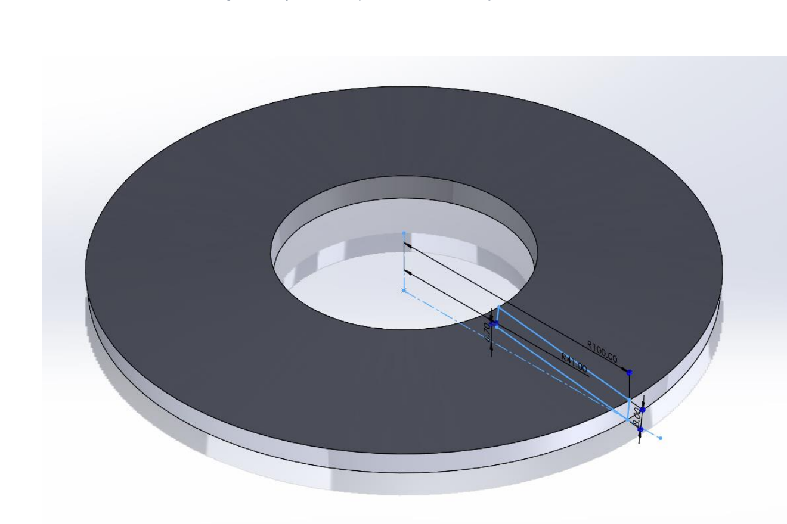
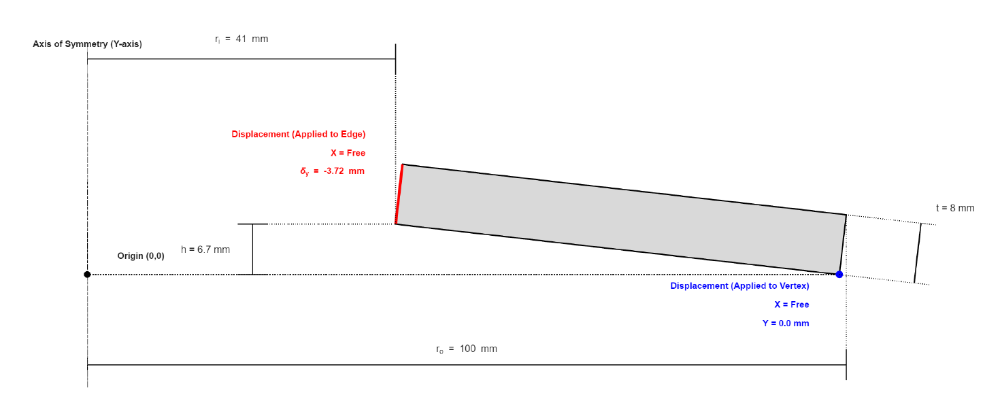
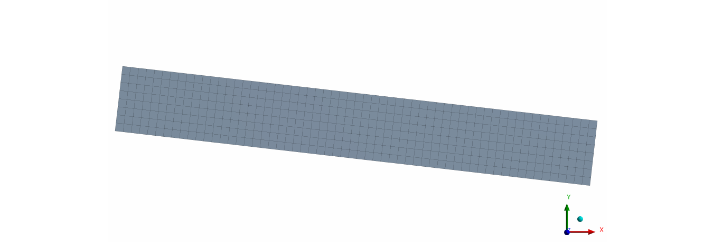
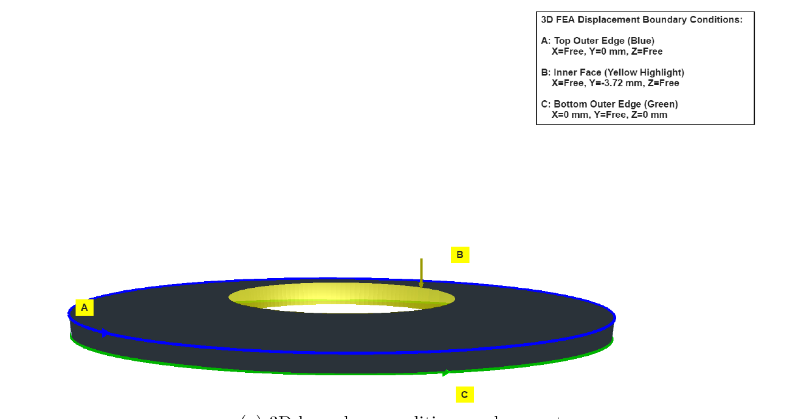
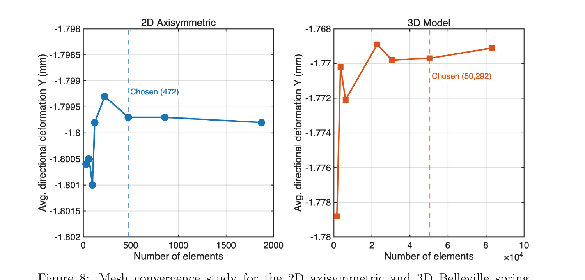
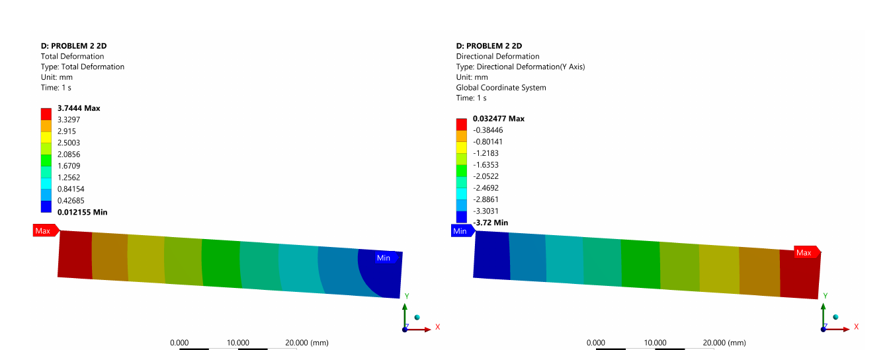
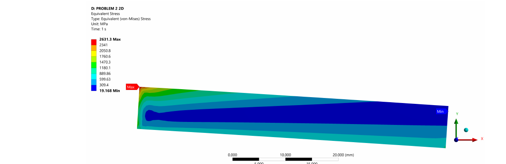
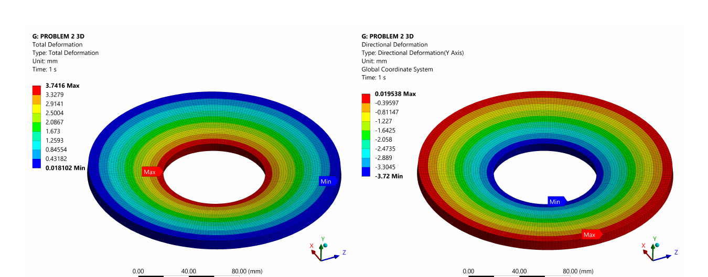
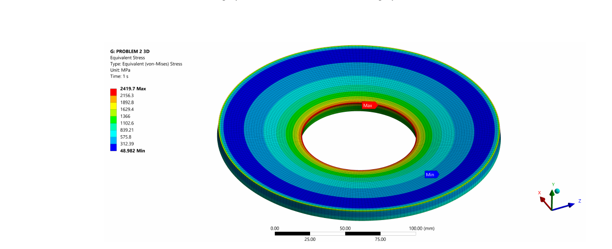

# Problem 2 — Belleville Spring: Analytical Method

## Geometry & Properties

Belleville spring washer, Part No. D2000828:

| Symbol | Description | Value |
|---|---|---|
| `Do` | Outer diameter | 200 mm |
| `Di` | Inner diameter | 82 mm |
| `t` | Thickness | 8 mm |
| `h` | Cone height | 6.7 mm |
| `E` | Young's modulus | 200 GPa |
| `μ` | Poisson's ratio | 0.3 |




## Governing Equations (Norton, 1996)

```
F(δ) = [4·E·δ / (K₁·Do²·(1−μ²))] · [(h−δ)(h − δ/2)·t + t³]

K₁ = (6 / π·ln(Rd)) · [(Rd−1)² / Rd²]

Rd = Do / Di
```

These are the standard closed-form equations for a conical disc spring undergoing axial deflection `δ`, used as supplied in the brief (after Norton, *Machine Design*, Prentice Hall, 1996).

## Step 1 — Geometry Factor

```
Rd = Do/Di = 200/82 = 2.439

K₁ = (6 / π·ln(2.439)) · [(2.439−1)² / 2.439²] = 0.7461
```

## Step 2 — Spring Constant via Central Finite Difference

The spring constant is the local slope of the (non-linear) force-deflection curve:

```
k = dF/dδ |_(δ=3.72)
```

This was approximated with a second-order central finite difference, step size `Δδ = 0.372` mm (10% of the target deflection, as specified in the brief):

```
k ≈ [F(δ+Δδ) − F(δ−Δδ)] / (2·Δδ) = [F(4.092) − F(3.348)] / 0.744
```

Evaluating `F(δ)` at the three deflection points:

| δ (mm) | F(δ) (N) |
|---|---|
| 3.348 | 63,833 |
| 3.720 | 68,791 |
| 4.092 | 73,458 |

```
k_analytical = (73,458 − 63,833) / 0.744 = 12,956 N/mm
```

## Comparison Against Manufacturer Data

| Quantity | Manufacturer | Analytical | Deviation |
|---|---|---|---|
| Force at δ=3.72mm | 68,204 N | 68,791 N | 0.86% |
| Peak stress | 1000 MPa | — (not predicted by this model) | — |

The analytical force prediction sits within 1% of the manufacturer's quoted figure, which is the benchmark the FEA models are then judged against.

## A Note on a Reporting Inconsistency in the Original Report

While transcribing these results, two numbers in the original report's discussion section don't agree with each other, and it's worth being upfront about it rather than quietly picking one:

- The **abstract** states *"The 2D FEA model agreed within 2.4%"* and Table 2's "Deviation from analytical (%)" column also lists **2.4%** for the 2D FEA row.
- Recomputed directly from the report's own numbers: **FEA 2D (66,533 N) vs. Analytical (68,791 N) is actually a 3.28% deviation.** The figure that *is* 2.4% (2.45%, to be precise) is **FEA 2D vs. the manufacturer's data (68,204 N)** — a different comparison entirely, even though the table column is explicitly labelled "deviation from analytical."

So the "2.4%" figure quoted throughout the original report's discussion is the FEA-vs-manufacturer comparison, mislabelled as FEA-vs-analytical. The FEA-vs-analytical figure is closer to 3.3%. Both numbers are small and don't change the report's conclusion (2D is still the more trustworthy model), but the table label and the prose don't actually match the number they're both citing. The 8.7% discrepancy quoted for the spring constant (`k_2D` vs `k_analytical`) **is** correctly calculated and consistent with the underlying data.

See [`force-table.md`](force-table.md) for the full four-way comparison (manufacturer / analytical / FEA 2D / FEA 3D) with both sets of deviation percentages shown explicitly.

## FEA Verification

### 2D Axisymmetric Model

Modelled as just the cross-section, exploiting the spring's perfect rotational symmetry. Large deflection (geometric non-linearity) was enabled, since the applied deflection is comparable in magnitude to the spring's own thickness.




### 3D Model

Generated by revolving the same cross-section 360°, with an additional boundary condition (outer top edge, X=0, Z=0) needed purely to prevent the model spinning freely about its own axis — a constraint the 2D model doesn't require, and the eventual source of the 3D model's over-prediction (see the [README](../README.md) and [`concept-design.md`](../docs/concept-design.md) for the full explanation).




### Grid Convergence

Both models were mesh-converged on average directional (axial) deformation before any result was trusted:



The 2D model converged by 472 elements (<0.003% change between finer meshes); the 3D model converged by 50,292 quadratic elements (<0.034% change). Both are well converged on deformation — the large discrepancy between the 3D model and everything else is *not* a meshing problem (see above).

### Deformation & Stress Contours

**2D:**




**3D:**




Both models show qualitatively the same deformation pattern (the cone flattening, max deflection at the inner bore matching the applied 3.72 mm boundary condition) — it's specifically the magnitude of the *force* and *spring constant* that diverge between them, not the deformation shape. The Von Mises peaks (2631 MPa 2D, 2420 MPa 3D) both sit at the sharp inner-bore corner and grow with mesh refinement rather than converging — a mesh-dependent stress singularity, not a physically meaningful result. See [`force-table.md`](force-table.md) for the bulk (non-singular) stress values, which stay under the 1000 MPa manufacturer limit in both models.

## MATLAB Implementation

The finite-difference calculation above is implemented in [`Problem2_BellevilleSpring.m`](Problem2_BellevilleSpring.m), which evaluates `F(δ)` as an anonymous function and reuses it for all three deflection points rather than retyping the equation three times.
