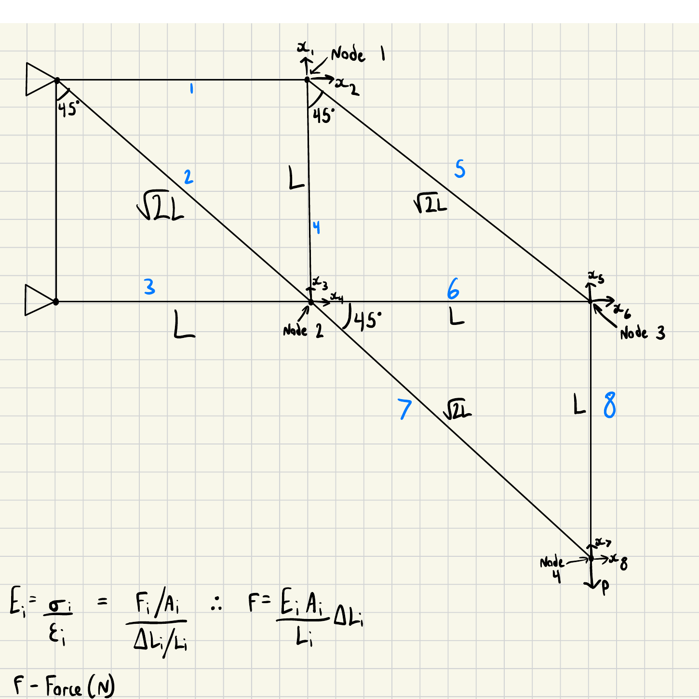
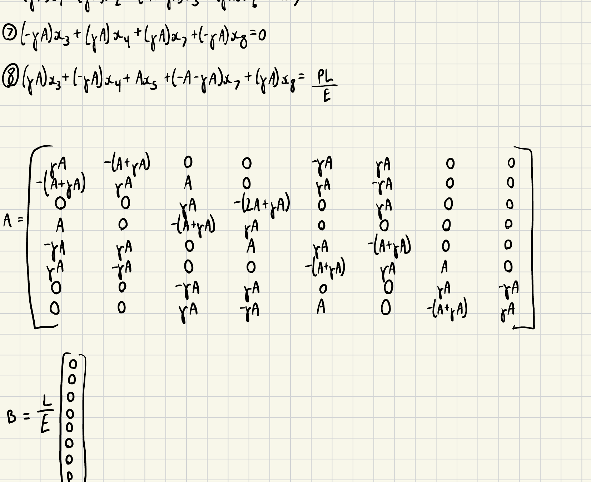
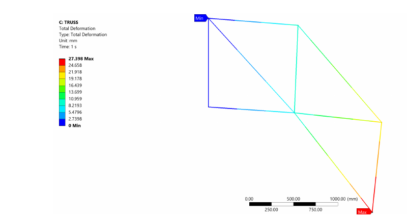
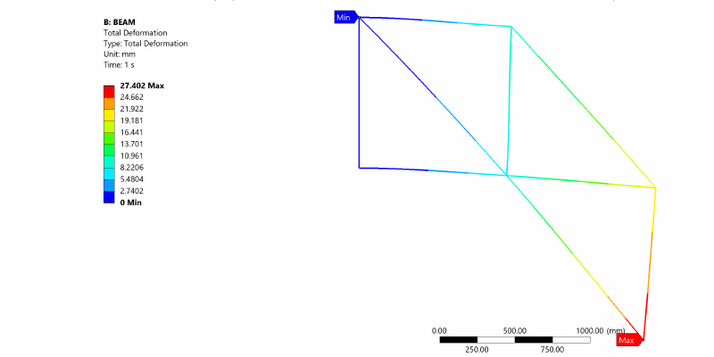
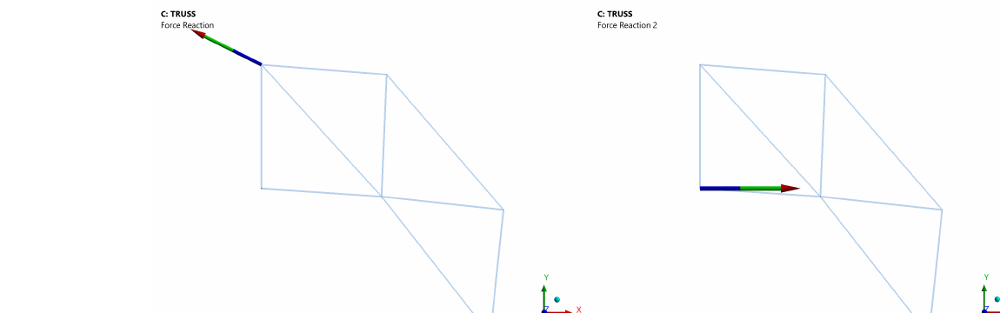
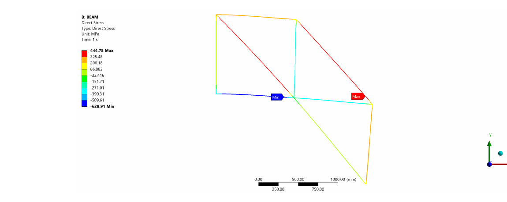
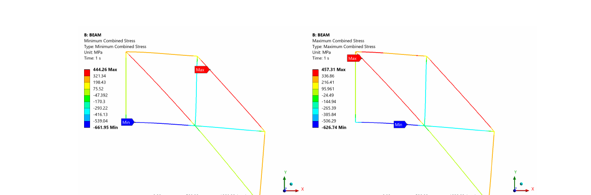

# Problem 1 — Equilibrium Truss: Hand Calculation & MATLAB Method

## Geometry & Properties

8 circular tube members, planar truss, fixed at two support nodes (A, B), loaded at the free end (Node 4) with `P = 20,000 N` downward.

| Symbol | Value |
|---|---|
| Outer diameter, `d_outer` | 15 mm |
| Inner diameter, `d_inner` | 12 mm |
| Unit length, `L` | 1000 mm |
| Young's modulus, `E` | 200 GPa (structural steel) |
| Applied load, `P` | 20,000 N |

Cross-sectional area (identical for all 8 members):

```
A = (π/4)(d_outer² − d_inner²) = (π/4)(15² − 12²) = 63.62 mm²
```

## Setup


*8 members, 4 nodes (1–4) plus 2 fixed supports (A, B). Members 2, 5, 7 run at 45°, length `√2·L`; the rest are horizontal or vertical, length `L`. ANSYS operates in 3D by default, so a `Z = 0` displacement constraint was applied across the whole body to force a planar (2D) response, matching the line-element assumption used in the hand derivation.*

## Derivation

Member axial force follows directly from Hooke's law for a 1D bar:

```
F_i = (E·A_i / L_i)·ΔL_i
```

Static equilibrium (ΣF_x = 0, ΣF_y = 0) was applied at each of the four free nodes in turn. For 45° members, `cos45° = sin45° = √2/2`, and a shorthand diagonal coefficient is used throughout:

```
γ = 1 / (2√2)
```

### Node 1



Free body at Node 1, members 1 (horizontal, to Node A), 4 (vertical, to Node 2), and 5 (45°, to Node 3):

```
ΣF_x:  −F₁ + F₅·sin45° = 0
ΣF_y:  −F₄ − F₅·cos45° = 0
```

with
```
F₁ = (E·A/L)·x₂
F₄ = (E·A/L)·(x₁ − x₃)
F₅ = (E·A/√2L)·[sin45°(x₆ − x₂) + cos45°(x₁ − x₅)]
```

Substituting and dividing through by `E/L` gives two of the eight equations:

```
(1)  (γA)x₁ + (−A−γA)x₂ + (−γA)x₅ + (γA)x₆ = 0
(2)  (−A−γA)x₁ + (γA)x₂ + (A)x₃ + (γA)x₅ + (−γA)x₆ = 0
```

### Node 2

Free body at Node 2, members 2 (45°, to A), 3 (horizontal, to B), 4 (vertical, to Node 1), 6 (horizontal, to Node 3), 7 (45°, to Node 4):

```
ΣF_x:  F₂·sin45° − F₃ − F₆ + F₇·sin45° = 0
ΣF_y:  F₄ + F₂·cos45° − F₇·cos45° = 0
```

giving:

```
(3)  (γA)x₃ + (−2A−γA)x₄ + (A)x₆ = 0
(4)  A·x₁ + (−A−γA)x₃ + (γA)x₄ = 0
```

### Node 3

Free body at Node 3, members 5 (45°, to Node 1), 6 (horizontal, to Node 2), 8 (vertical, to Node 4):

```
ΣF_x:  −F₆ + F₅·sin45° = 0
ΣF_y:  F₅·cos45° − F₈ = 0
```

giving:

```
(5)  (−γA)x₁ + (γA)x₂ + (A)x₄ + (γA)x₅ + (−A−γA)x₆ = 0
(6)  (γA)x₁ + (γA)x₂ + (−A−γA)x₅ + (γA)x₆ + A·x₇ = 0
```

### Node 4

Free body at Node 4, members 7 (45°, to Node 2), 8 (vertical, to Node 3), and the external load `P`:

```
ΣF_x:  −F₇·sin45° + ... = 0
ΣF_y:  −F₇·cos45° + F₈ = P
```

giving the final two equations:

```
(7)  (−γA)x₃ + (γA)x₄ + (γA)x₇ + (−γA)x₈ = 0
(8)  (γA)x₃ + (−γA)x₄ + A·x₅ + (−A−γA)x₇ + (γA)x₈ = PL/E
```

*(Full working, including the intermediate algebra for every node, is in [`report/full-report.pdf`](../report/full-report.pdf), Appendix B.)*

## Assembled System

With `A₁ = A₂ = ... = A₈ = A` (uniform cross-section), equations (1)–(8) assemble into an 8×8 system `Ax = b`:



```
        ⎡  γA      −(A+γA)    0        0       −γA      γA       0       0   ⎤
        ⎢−(A+γA)    γA        A        0        γA      −γA      0       0   ⎥
        ⎢  0        0         γA      −(2A+γA)  0        A       0       0   ⎥
   A =  ⎢  A         0        −(A+γA)   γA       0        0       0       0   ⎥
        ⎢ −γA       γA        0        A        γA      −(A+γA)  0       0   ⎥
        ⎢  γA       −γA       0        0       −(A+γA)   γA       A       0   ⎥
        ⎢  0         0       −γA       γA        0        0       γA     −γA  ⎥
        ⎣  0         0        γA      −γA        A        0      −(A+γA)  γA  ⎦

   b = (L/E)·{0, 0, 0, 0, 0, 0, 0, P}ᵀ
```

This is the matrix implemented in `Amatrix` in [`Problem1_Truss.m`](Problem1_Truss.m) (also reproduced in the report appendix). `γ` and `A` are kept as separate, substitutable variables in the code rather than pre-multiplied numeric constants — that's what lets the same script run for a different tube size or member layout without re-deriving the matrix by hand.

## Solution Method

Solved with MATLAB's backslash operator, `x = A\b`, which applies LU decomposition. For a small (8×8), dense, well-conditioned system like this one, LU decomposition via backslash is both the simplest and the numerically stable choice — there's no real benefit to writing a custom Gaussian elimination routine, and explicit matrix inversion (`inv(A)*b`) is avoided because it's needlessly less stable for no accuracy gain.

## FEA Verification

The same geometry was modelled in ANSYS Mechanical twice: once with link (axial-only) elements matching the pin-jointed assumption above exactly, and once with beam elements that also transmit bending moment between joints.




*Both models predict a near-identical deformed shape and peak displacement (27.398 mm truss, 27.402 mm beam) — the beam model's extra stiffness from joint moment continuity makes almost no visible difference to the deflected shape, even though it does measurably change the member stresses (below).*

Reaction force probes at both fixed supports confirm static equilibrium:



```
Support 1:  Fx = −40,000 N,  Fy = 20,000 N
Support 2:  Fx =  40,000 N,  Fy =      0 N
Sum:        ΣFx = 0 N,        ΣFy = 20,000 N  ✓ matches applied load P
```

### Member Stress (Beam Model Only)

Link elements only carry axial force, so ANSYS' beam tool (which reports combined bending + axial stress) was only meaningful on the beam model:




Peak combined stress reached 661.95 MPa compression and 457.31 MPa tension — both well above the 250 MPa yield stress of structural steel, on the diagonal members nearest the load. See the main [README](../README.md) for what that implies for the design.

## Results

See [`force-table.md`](force-table.md) for the full nodal displacement comparison against both FEA models, and the main [README](../README.md) for the headline numbers and discussion.
